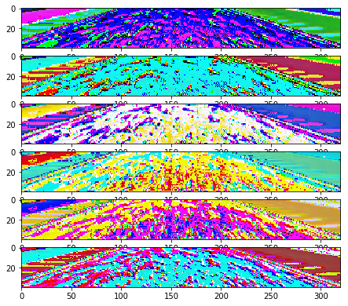
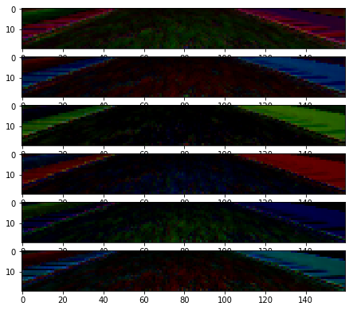
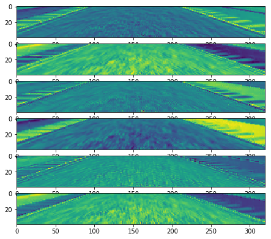
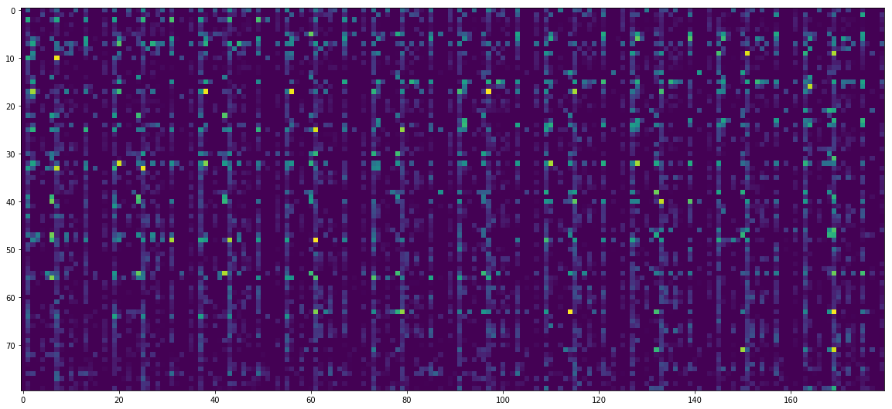

# Project summary

## Files

My project includes the following files:
* model.py.ipynb **This is a jupyter notebook** 
* drive.py
* model.h5 -- the trained model
* writeup_report.md -- the project summary
* video.mp4 -- a captured video

## Submission

Using the Udacity provided simulator and my drive.py file, the car can be driven autonomously around the track by executing 
```sh
python drive.py model.h5
```
The final video is also included (video.mp4) as well as on youtube: 

https://www.youtube.com/watch?v=3qJBjIvFs9k

I've also written a medium article about the intermediate layers:

https://medium.com/@tempflip/how-robotic-cars-see-the-world-6af0808451fa#.ub60oe7er


## Training data

I'm not using the data provided by udacity, but collected it myself. The reason for doing this that I wanted to see the difference between trainig on different amount and quality data. I'm both using track 1 and track 2 data.

I'm loading all the data into a pandas DataFrame. I'm throwing away the points which has a steering angle less than +-0.2 . The reason for this that the points which has a 0 steering angle can't improve the model at all; and I've noticed that when I train only on relatively higher steering angles, I get better results. 

## The generator

I'm using a generator function for loading the images, as I wanted to create a scaleble way to load images into the memory.
The generator does one pre-processing step:
It returns for every image 2 image: the original image and a left/righ flipped image with a negative steering angle. It helps to normalize the number of left/right turns in the training dataset.

## Model Architecture

My model is very simple:

```
def crop(d):
    return d[:,80:120,:,:]

def normalize(d):
    return d / 255 - 0.5

def reduce_palette(d):
    import tensorflow as tf 
    n = 40
    return tf.ceil((d/n)*n)

model = Sequential()

model.add(Lambda(reduce_palette, input_shape=(160, 320, 3)))
model.add(Lambda(normalize))
model.add(Lambda(crop))

model.add(Convolution2D(9,3,3, border_mode="same", name="conv1"))
model.add(MaxPooling2D((2,2)))
model.add(Dropout(0.1))
model.add(Activation('relu', name="relu1"))

model.add(Convolution2D(18,3,3, border_mode="same", name="conv2"))
model.add(MaxPooling2D((2,2)))
model.add(Dropout(0.1))
model.add(Activation('relu', name="relu2"))

model.add(Flatten())
model.add(Dense(10))
model.add(Dense(1))
```

I'm starting with some pre-processing steps (cropping, normalizing and reducing palette.) I've noticed that if I reduce palette my model gets better results -- this is probably because it creates a more generic understanding of the input image. Also, a smaller window (the cropping step) looks better than a larger one.

After pre-processing I'm adding to convolutional layers, both with 3x3 windows, a 2x2 pooling layer and a RELU activation function.
Please see my reflections about the inside data here:

https://medium.com/@tempflip/how-robotic-cars-see-the-world-6af0808451fa#.ub60oe7er

After the convolutinal layers I'm adding 2 fully connected layers, and the final result is a 1x1 matrix (the steering angle.)

I've tryed to add more convolutional layers, but they did not improve the performance -- it looks like after 2 convolutions the network can get enough data to create a generic understanding of the camera position compared to the road edges.

Also, adding more fully connected layers did not improve much the performance.

## Training Strategy

I'm using the 'adam' optimizer; the loss function is a MSE. I'm running the optimizer for 10 epochs, 10.000 samples in every epoch.
I'm saving the model into a file (model.m5, included in the repo) which can be read by the drive.py script.

## Layer visualizations

In order to visualise the network I need to rebuild it in a slightly different form -- in order to update the weights I can't have Dropout layers, so I'm getting rid of them. After rebuilding the network, I am setting the weights from the trained layers of my original network:

```
vis_model.layers[3].set_weights(layer_dict['conv1'].get_weights())
vis_model.layers[4].set_weights(layer_dict['maxpooling2d_29'].get_weights())
vis_model.layers[5].set_weights(layer_dict['relu1'].get_weights())
vis_model.layers[6].set_weights(layer_dict['conv2'].get_weights())
etc
etc
```


I've created 2 helper functions in order to get the  data from the network's middle layers:

```
def get_middle_model(m, i, o):
    d = dict([(l.name, l) for l in m.layers] )
    return Model(input = d.get(i).input, output = d.get(o).output)

def get_middle_predict(m, i, o, inp_data):
    return get_middle_model(m, i, o).predict(inp_data)

_pr = get_middle_predict(vis_model, 'start', 'conv1', _img)
```

`get_middle_model` creates a new Model instance using the passed Model with the given input and output layers.
`get_middle_predict` is a wrapper for getting the predictions for data using the given input/output layers.

See the last line as an example: it returns middle layer output (prediction) for `_img` input data using `vis_model`, starting from `start` layer and ending at `conv1` layer.

Using these techniques I can visualize the states of the input layers for any input. For more details, please see this post:

https://medium.com/@tempflip/how-robotic-cars-see-the-world-6af0808451fa#.ub60oe7er

### 1st convolutional layer:



### 1st activation layer:



### 2nd convolutional layer:



### 1st fully connected layer (2dim reshape)



